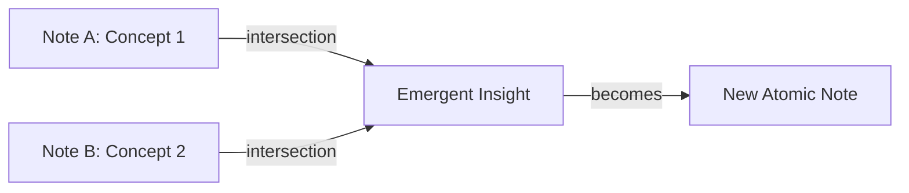

# Emergence in Knowledge Graphs

Emergence occurs when a system exhibits properties its individual components don't have alone.

## In Knowledge Graphs

**Simple components:**
- Individual atomic notes (one idea each)

**Emergent properties:**
- New insights from note combinations
- Unexpected connections between domains
- Novel concepts arising from intersections

## How Emergence Works

1. Two unrelated notes share hidden connection
2. Agent identifies intersection
3. New note created capturing emergent insight
4. Graph density increases, more emergence possible

## Requirements for Emergence

1. **Density** - Enough notes and links for intersections
2. **Diversity** - Notes from different domains
3. **Active linking** - Regular connection creation
4. **Agent attention** - Identifying hidden patterns

## Our Vault

We track emergence through:
- `graph_related` - Find 2-hop connections
- `graph_get_neighbors_ranked` - Identify strong intersections
- Regular review in REFLECT mode

## Anti-Patterns That Prevent Emergence

- Too few notes (no critical mass)
- Over-linking (everything connects to everything = noise)
- No cross-domain notes
- Agent only adds, never synthesizes

## Related
- [[Knowledge Graph Structure]]
- [[Zettelkasten Method]]
- [[Self-Improvement Cycle]]
