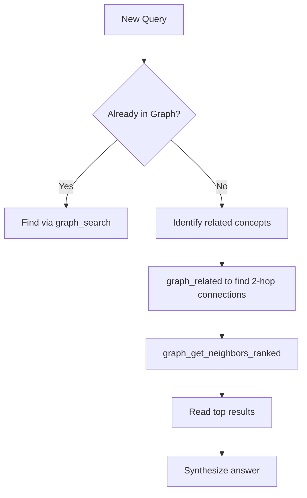

# Graph Navigation Best Practices

Best practices for navigating knowledge graphs effectively.

## Agent Navigation Workflow



## Best Practices

1. Always rebuild index after bulk changes: `graph_build_index`
2. Use `graph_hubs` to find good entry points
3. Check `graph_isolated_nodes` regularly
4. Use `graph_related` for discovery

## Graph vs Folder Search

| Folder Search | Graph Search |
|---------------|--------------|
| "Where did I put it?" | "What connects to X?" |
| By date or topic | By relationship |
| One path | Multiple paths |

## When to Use Each Technique

- **Know the topic** → Concept Search
- **Exploring connections** → Neighbor Search  
- **Finding hidden connections** → Related Search
- **Finding entry points** → Hub Search

## Common Anti-Patterns

- **Searching by date** — Dates don't matter in graphs
- **Searching by folder** — There are no folders (see [[Knowledge Graph Structure]])
- **Only using full-text** — Relationship search finds better results

## Graph Density Principles

- **Optimal density:** 2-7 links per note (minimum 2, target 3-5, maximum 7)
- **Quality over quantity:** Each link should add unique navigational or conceptual value
- **Hub capping:** When a hub exceeds 10+ outgoing links, create intermediary hub notes
- **Prune ruthlessly:** Remove decorative links that don't serve a navigation purpose

See [[AI-Assisted Knowledge Management Seed]] for full rules on graph density.

## MCP Tools Reference

The vault-graph MCP server provides navigation tools:

### graph_search
Find nodes by title or keywords.
```
graph_search(query: "atomic", limit: 5)
```

### graph_hubs
Find the most connected nodes (entry points).
```
graph_hubs(limit: 10)
```

### graph_get_neighbors
Get direct connections from a node.
```
graph_get_neighbors(node: "Concept.md", direction: "both")
```

### graph_get_neighbors_ranked
Get connections sorted by relevance.
```
graph_get_neighbors_ranked(node: "Concept.md", limit: 10)
```

### graph_related
Find connections 2 hops away.
```
graph_related(node: "Concept.md", limit: 5)
```

### graph_isolated_nodes
Find nodes without connections.
```
graph_isolated_nodes()
```

### graph_build_index
Rebuild the graph index after changes.
```
graph_build_index(force: true)
```

**GitHub:** https://github.com/pascalweiss/vault-graph-mcp

## Related
- [[Graph Maintenance]]
- [[Knowledge Graph Structure]]
