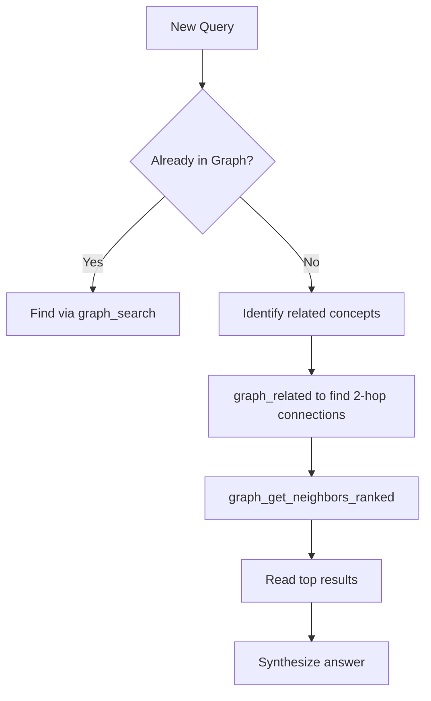

# Graph Traversal Efficiency

The agent must be able to **quickly navigate** from any note to find requested information.

## Rule
- Maximum 3 hops to reach any note from a hub
- Use hub notes as entry points for broad topics
- Ensure every note is reachable from at least one hub

## Test Criteria (for AI Evaluation)
- [ ] Can any note be reached in ≤3 hops from a hub?
- [ ] Do hub notes exist for major topics?
- [ ] Are there any isolated notes with <2 links?
- [ ] Can you navigate from root to any note in ≤3 steps?

## Agent Navigation Strategy
```
1. Identify the query topic
2. Start from relevant hub note
3. Follow links through intermediate notes
4. Reach target note within 3 hops
```

## Hub Nodes
Hub notes are highly connected entries for broad topics:
- Use `graph_hubs` to find most connected notes
- Create hub notes for major themes
- Hub notes should link to sub-topic notes
- Keep hubs under 200 words — their job is navigation, not content

## Graph vs Hierarchy
Graph beats hierarchy because:
- No "where should I put this?" — just link
- Serendipitous discovery through connections
- No duplicate notes — one atomic note, many links
- Structure emerges from content, not rigid folders

## Why 3 Hops?
- Beyond 3 hops, relevance decreases rapidly
- 3 hops balance depth with discoverability
- Agents can traverse efficiently

## Maintenance
Regularly check:
- `graph_isolated_nodes` — find orphaned notes
- `graph_related` — find hidden connections
- Rebuild index if graph feels slow

## MCP Tools Reference

The vault-graph MCP server provides navigation tools:

### graph_search
Find nodes by title or keywords.
```
graph_search(query: "atomic", limit: 5)
```

### graph_hubs
Find the most connected nodes (entry points).
```
graph_hubs(limit: 10)
```

### graph_get_neighbors
Get direct connections from a node.
```
graph_get_neighbors(node: "Concept.md", direction: "both")
```

### graph_get_neighbors_ranked
Get connections sorted by relevance.
```
graph_get_neighbors_ranked(node: "Concept.md", limit: 10)
```

### graph_related
Find connections 2 hops away.
```
graph_related(node: "Concept.md", limit: 5)
```

### graph_isolated_nodes
Find nodes without connections.
```
graph_isolated_nodes()
```

### graph_build_index
Rebuild the graph index after changes.
```
graph_build_index(force: true)
```

**GitHub:** https://github.com/pascalweiss/vault-graph-mcp

## Graph Density Principles

- **Optimal density:** 2-7 links per note (minimum 2, target 3-5, maximum 7)
- **Quality over quantity:** Each link should add unique navigational or conceptual value
- **Hub capping:** When a hub exceeds 10+ outgoing links, create intermediary hub notes
- **Prune ruthlessly:** Remove decorative links that don't serve a navigation purpose

See [[AI-Assisted Knowledge Management Seed]] for full rules on graph density.

## Agent Navigation Workflow



## Related
- [[Hub Node Creation]]
- [[Graph Maintenance]]
- [[Note Insertion Strategy]]
- [[Frontier Exploration - Vault Structure and Discovery Bias]] — How structure affects what gets discovered
- [[Stress Test - 3-Hops Rule in Genealogy]] → now merged into [[Seed Stress Test - Graph Density Rule in Genealogy]]
- [[Graph Traversal Efficiency]] — Merged into this note
