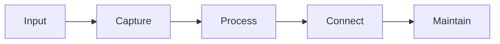

# Graph Visualization

Visualizing knowledge graphs helps spot patterns, find gaps, and navigate efficiently.

## Why Visualize

Graph visualization helps:
- Identify hub nodes and clusters
- Find isolated notes
- Understand connection patterns
- Spot structural issues

## Visualization Tools

| Tool | Purpose |
|------|---------|
| Obsidian Graph View | Built-in 3D graph visualization |
| Mermaid | Inline diagrams in notes |
| Draw.io | External diagrams |
| NetworkX + Python | Custom visualizations |

## Mermaid Example

## Metrics to Visualize

- **Hub score** — Most connected notes; navigation anchors
- **Clustering** — Topic groups of dense connections
- **Path length** — Navigation distance (shorter is better)
- **Isolation** — Notes with few connections, hard to discover

## Related
- [[Graph Navigation Best Practices]]
- [[Graph Traversal Efficiency]]
- [[Graph Maintenance]]
- [[Knowledge Graph Structure]]
