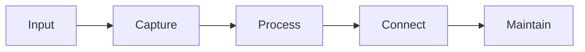
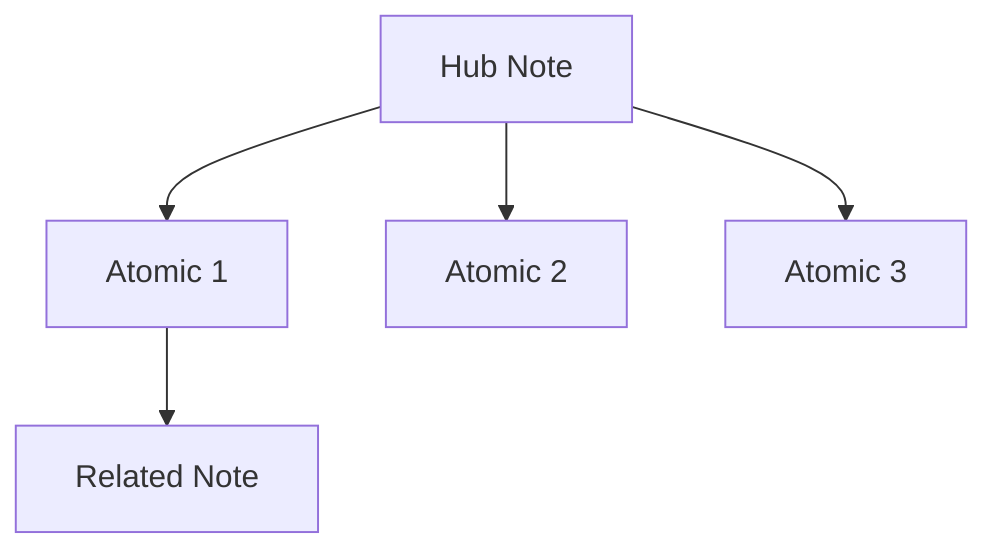

# Knowledge Visualization

Visualizing knowledge graphs for better understanding and navigation. Making the invisible structure of your knowledge visible helps spot patterns, find gaps, and navigate efficiently.

---

## Why Visualize

Graph visualization helps:
- Identify hub nodes and clusters
- Find isolated notes
- Understand connection patterns
- Spot structural issues

---

## Tools

| Tool | Purpose |
|------|---------|
| Obsidian Graph View | Built-in 3D graph visualization |
| Mermaid | Inline diagrams in notes |
| Draw.io | External diagrams |
| NetworkX + Python | Custom visualizations |

---

## Mermaid Examples

### Knowledge Flow

### Note Relationships

---

## Graph Metrics to Visualize

Understanding these metrics helps you assess your knowledge base's health:

- **Hub score** (also: most connected notes) - Notes that link to many other notes; these are your navigation anchors
- **Clustering** (also: topic groups) - Dense clusters of connected notes around a common theme
- **Path length** (also: navigation distance) - How many clicks it takes to get from one note to another; shorter is better
- **Isolation** (also: orphan notes) - Notes with few or no connections that are hard to discover

---

## Seed Rules Demonstrated

This note relates to several Seed rules:
- **Graph Maintenance** — supports the "Run structural health checks regularly" rule
- **Graph Traversal Efficiency** — visualization helps verify the "3 hops or fewer" rule
- **Hub Node Creation** — visualization reveals potential hub notes
- **Graph Density Management** — visualization exposes density issues

---

## Related
- [[Graph Maintenance]]
- [[Graph Traversal Efficiency]]
- [[Hub Node Creation]]
- [[Graph Density Management]]
