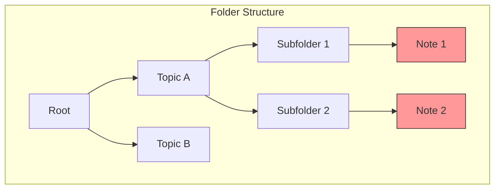
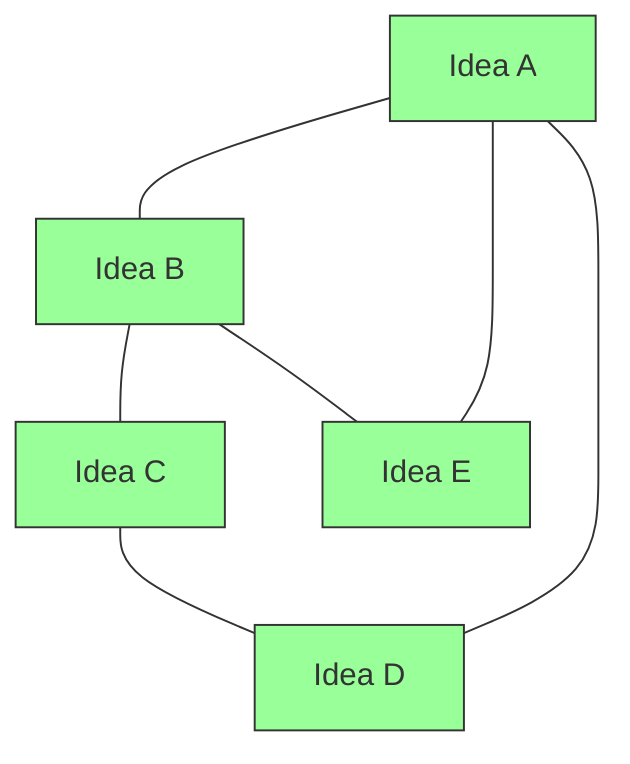

# Why Graph-Based Knowledge Works

A graph-based knowledge system outperforms traditional hierarchical systems.

## The Problem with Folders

- Notes in different folders **cannot see each other**
- You must remember **where you put things**
- Cross-topic connections are **impossible**

## The Power of Graphs

- **Any note connects to any note**
- **Discoverability** through graph traversal
- **Emergent structure** from content itself

## Network Effects

As the graph grows:

| Growth | Folder System | Graph System |
|--------|---------------|--------------|
| 100 notes | Hard to navigate | Rich connections |
| 1000 notes | Overwhelming | Value increases |
| 10000 notes | Broken | Knowledge engine |

## The Serendipity Factor

Graphs enable **unexpected discoveries**:
- `graph_related` finds non-obvious connections
- Following backlinks reveals hidden patterns
- Hub nodes surface important concepts

## Our Implementation

We combine:
- [[Zettelkasten Method]] (atomic notes)
- [[Knowledge Graph Structure]] (connections)
- [[Graph Navigation MCP]] (agent capability)

## Related
- [[Zettelkasten Method]]
- [[Knowledge Graph Structure]]
- [[Graph Traversal Efficiency]]
