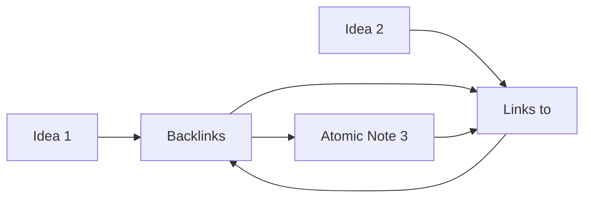

# Zettelkasten Method

The Zettelkasten (German for "slip box") method is a foundational approach to networked knowledge management.

## Origin
Developed by **Niklas Luhmann**, a German sociologist who wrote 70+ books and 400+ academic articles using only his Zettelkasten.

## Core Philosophy
- **Atomic notes** — One idea per note
- **Unique IDs** — Each note has a unique identifier for direct addressing
- **Linking** — Notes connect to related notes, forming a web of knowledge

## How It Works



## The Luhmann Principle
> "I do not think for myself, I let my Zettelkasten think for me."

The system becomes a **thinking partner** that generates insights through connections.

## The Numbering Myth

Common misconception: Zettelkasten uses sequential IDs (1, 1a, 1b, 1b1...)

Reality: Luhmann used **links**, not IDs. The ID system was a later interpretation.

## The Essential Rules (Luhmann)

1. Write one idea per note
2. Write in your own words
3. Link notes together
4. Add permanent notes sequentially
5. Never delete - only deprecate

## Modern Adaptation

We use wikilinks instead of IDs:
```
Concept instead of "Note 1a"
```

This is actually closer to Luhmann's original method than the ID system.

## Key Differences from Traditional Notes
| Traditional | Zettelkasten |
|-------------|---------------|
| Hierarchical folders | Network of links |
| Notes stand alone | Notes are interconnected |
| Hard to find connections | Graph reveals connections |
| Notes get lost | Every note is discoverable |

## Our Implementation
We use [[Atomic Note Principle]] and [[Linking Principle]] to implement Zettelkasten digitally.

## Related
- [[Atomic Note Principle]]
- [[Linking Principle]]
- [[AI-Assisted Knowledge Management Seed]]
